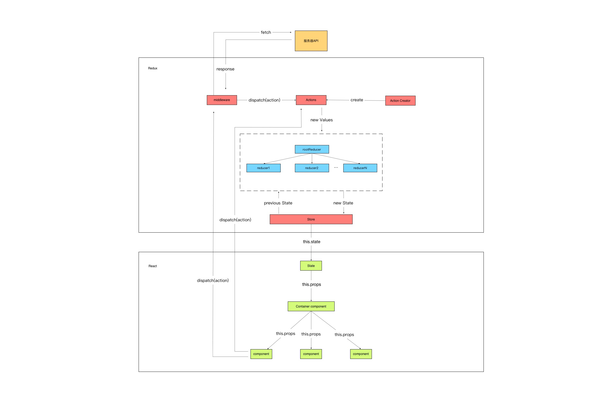

采用react+redux的数据与UI分离的架构。redux负责数据处理，react负责UI展现。
##### Redux名词解释：
* actions：动作，每个动作一个action。通过store.dispatch()将action传到store。仅仅是描述动作的发生，不会去更新store。
* reducer：处理函数，更新store。可多个action对应一个reducer。
* store：维持数据仓库，提供四种方法getState()获取state，dispatch(action)更新state，subcribe(listener)注册监听器，replaceReducer(nextReducer)替换 store 当前用来计算 state 的 reducer。
* Middleware：中间件，由于Redux仅支持同步数据，因此需要通过中间件来实现异步数据加载。
* 数据流：严格的单项数据流，遵循函数式范式，数据不可变。

##### React名词解释
* JSX：是一个看起来很像 XML 的 JavaScript 语法扩展。React 可以用来做简单的 JSX 句法转换。
* 虚拟DOM：React在内存中维护一个快速响应的DOM描述。render()方法返回一个DOM的描述，React能够利用内存中的描述来快速地计算出差异，然后更新浏览器中的DOM。
* 组件生命周期：挂载（组件被插入到DOM中），更新（组件被重新渲染，查明DOM是否应该刷新），移除（组件从DOM中移除）。

##### 数据流程
* Redux会维持一个Store，通过关联React与Redux，把Store中的数据state传入到React中。
* React中通过actions来描述各种动作并把数据传入到Store。
* 传入Store中的数据会通过reducer来进行处理并更新State。
* Redux会创建一个初始化State，并把State传递给React。
* 在React组件挂载的时候，会去dispatch(action)到Middleware(中间件)，然后中间件action会去进行异步请求从服务器端取数据。
* 在拿到数据后，会通过dispatch(action)把数据传递给Store，Store通过reducer来进行数据处理和更新State。
* State更新后，会把新的State传递给React，React在拿到新的State后，又回把State一层一层的传递到子组件中，子组件拿到新的State后会进行UI渲染的处理。
* 在React中，如果交互需要对数据进行操作。React中不会直接操作数据，而是通过dispatch(action)把数据传递给Store中，让Redux来进行数据的处理(包括异步处理)。
* 整个流程实际上就是通过Redux来进行数据操作和管理，然后把数据传递给React，React通过拿到的数据来驱动UI渲染。实现数据与UI展现分离。
